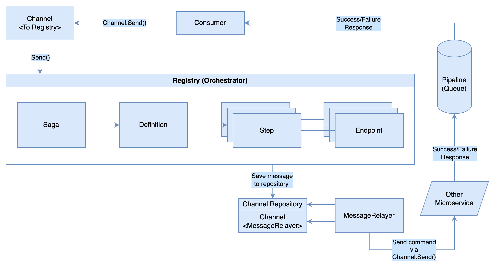

# Saga Framework

[English](description.md)

- [Saga Framework](#saga-framework)
    * [개요](#개요)
    * [구성 요소](#구성-요소)
        + [Channel](#channel)
        + [MessageRelayer](#messagerelayer)
        + [ChannelRegistry](#channelregistry)
        + [Definition](#definition)
        + [Step](#step)
        + [Endpoint](#endpoint)
        + [Saga](#saga)
        + [Session](#session)
        + [Registry](#registry)
    * [전체 구성](#전체-구성)

## 개요

마이크로서비스 간의 트랜잭션을 보장하기 위하여 Saga Framework를 활용합니다. 두 프레임워크는 동일한 논리와 도메인을 공유하고 있습니다.

- Typescript: [violetpay-org/point3-typescript-saga](https://github.com/violetpay-org/point3-typescript-saga)

- Go: [violetpay-org/go-saga](https://github.com/violetpay-org/go-saga)

## 구성 요소

### Channel

두 종류가 있습니다. 각각의 채널은 상황에 맞게 사용되어야 합니다.

- \<To Registry\> Side

Saga가 Message를 소비할 수 있도록 Registry에 전달해주는 창구입니다. 이때 Saga가 소비하는 메세지는 다른 어떤 서비스의 성공/실패 응답입니다. 이 채널의 `Send()` 메서드는 메세지를 Registry에 보내는 구현입니다.

- \<MessageRelayer\> Side

Saga가 다른 서비스에 Message를 발행할 수 있도록 하는 창구입니다. 이때 Saga가 발행하는 메세지는 즉시 발행되지 않고 MessageRelayer에게 전달하기 위해서 채널의 레포지토리에 저장합니다. 실제로 메세지를 발행하기 위해 `Send()` 메서드 구현이 필요합니다. 해당 메서드는 MessageRelayer가 부릅니다.

### MessageRelayer

MessageRelayer는 ChannelRegistry에 등록된 Channel의 레포지토리를 통해 메세지를 읽고, 채널의 `Send()` 메서드를 통해 메세지를 발행합니다. `Send()` 는 프레임워크를 사용하는 사용자가 구현해야 합니다. 이 작업은 일정 시간 (e.g. 1초) 단위로 Batch로 실행될 수 있습니다.

### ChannelRegistry

ChannelRegistry는 여러 채널을 모은 레지스트리입니다. 해당 레지스트리에 MessageRelayer가 사용할 여러 채널을 등록할 수 있습니다.

### Definition

Definition은 Saga의 정의로서 여러 Step를 가질 수 있습니다.

### Step

Step은 하나의 서비스에서 실행되는 작업의 단위입니다.

1. 하나의 Step은 하나의 Endpoint를 가집니다.
2. Step은 Endpoint를 통해 구성된 Invocation을 가집니다.
3. Step은 로컬(Local)에서 실행되는 작업이거나, 외부 서비스(Remote)를 통해 실행되는 작업입니다.
4. 만약 해당 Step 이후 어떤 Step이 실패한다면, 실패한 어떤 Step 이전의 Step에게 Compensate (보상)을 합니다.
5. Step은 이후 Step의 실패 시 작업을 Rollback하기 위한 Compensation을 지정할 수 있습니다. Compensation은 Invocation과 동일하게 Endpoint를 통해 구성됩니다.

### Endpoint

Endpoint는 실제 이루어질 내부 작업을 정의합니다.

- Endpoint (Remote Endpoint)

Endpoint는 외부 서비스를 통해 이루어질 작업을 정의합니다. 따라서 외부 서비스에게 명령하기 위한 메세지 (Command)와 명령 생성자 (CommandConstructor)를 가지고 있으며, 엔드포인트 생성 시에도 필요합니다. 이렇게 정의된 엔드포인트는 RemoteStep이 시작될 때 활용됩니다:

1. Orchestrator는 CommandConstructor를 통해 Command를 생성합니다.
2. 생성된 Command를 \<MessageRelayer\> Channel 레포지토리에 저장합니다.

- LocalEndpoint

LocalEndpoint는 로컬에서 실행될 작업을 정의합니다. `handle()` 을 통해 실제 실행될 작업이 정의됩니다. 작업 정의를 위해 `handle()` 구현이 필요합니다. 또한 LocalEndpoint가 성공/실패한 후 응답 메세지를 발행할 수 있습니다 (해당 엔드포인트 응답을 참조하는 다른 외부 서비스가 있을 수 있다는 것을 암시합니다). 따라서 외부 서비스가 응답을 참조할 수 있도록 하기 위한 Channel과 응답 생성자 (SuccessResponseConstructor / FailureResponseConstructor)를 가지고 있습니다.

1. Orchestrator은 handle()을 실행한 후 Constructor을 통해 handle 결과에 따라 Success 또는 Failure Response를 생성합니다.
2. 생성된 Response를 Channel 레포지토리에 저장합니다.

### Saga

Saga는 Definition을 포함하여 정의된 사가 작업 단위입니다. 사가가 실행되면 Session이 생성되며, 각각의 Step은 Session을 통해 데이터를 주고 받을 수 있습니다. 일련의 사가 실행에 대하여 하나의 Session을 가집니다.

### Session

Session은 여러 Step끼리 데이터를 주고 받기 위한 정보의 단위입니다. 세션은 CurrentStep, State를 가지고 있습니다. State는 `Compensating`, `Failed`, `Completed`, `Retrying`중 하나일 수 있습니다.

사가가 실행되면 일련의 사가 실행에 대하여 하나의 Session이 생성되며, 이 세션은 사가 실행이 종료 (완료 혹은 실패)할 때까지 유효합니다. 사가 실행이 종료되었다는 건 State가 `Failed` 혹은 `Completed` 상태에 있다는 것을 말하며, Dead Session이라고 말합니다.

### Registry

Registry는 여러 Saga를 모은 레지스트리입니다. 해당 레지스트리에 사용할 여러 Saga를 등록할 수 있습니다.

## 전체 구성

1. 최초 시작은 `Registry.StartSaga()` 로 시작합니다.
2. 이후 ***Saga → Definition → Step → Endpoint*** 과정을 거쳐 Channel Repository에 메세지를 저장합니다. 메세지는 엔드포인트의 종류에 따라 Command이거나, Response일 수 있습니다.
3. 메세지가 아직 발행되지 않았고, Saga는 어떤 **응답**을 기다리고 있으므로 Pending 상태입니다.
4. MessageRelayer가 메세지를 발행합니다.
    1. 로컬 엔드포인트의 경우 Channel Repository에 저장된 메세지는 Response이므로, MessageRelayer는 해당 Response를 채널로 보냅니다.
    2. 리모트 엔드포인트의 경우 Channel Repository에 저장된 메세지는 Command이므로, 채널을 통해 외부 서비스에 메세지 (Command)를 보냅니다.
        1. 외부 서비스는 성공/실패 응답을 생성합니다. 이 응답은 어떤 통로를 통해서 \<To Registry\> Channel에게 도달해야 합니다. 위 예시의 경우 Pipeline으로 Message Queue가 사용되었으며, Consumer를 통해 채널에 도달합니다 (사용자가 설계 및 구현해야 함)
5. \<To Registry\> Channel에 도달한 응답은 Registry로 소비됩니다. 응답을 받은 Orchestrator는 해당 Step을 완료하고, 응답 형태 (Success / Failure)에 따라 다음 Invocation, Compensation 실행 여부를 결정할 것입니다.